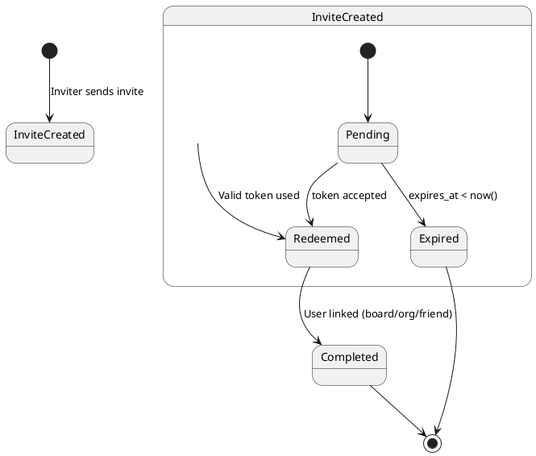
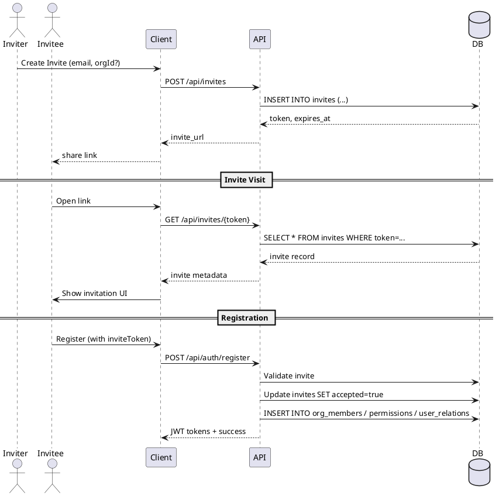

# **StickyBoard – Invite System Design**

## **Overview**

The StickyBoard Invite System enables **user-to-user onboarding and content sharing** through secure, token-based invitations.

Invites allow:
- **Organization invitations** → join a workspace/team.  
- **Board invitations** → access a shared board directly.  
- **Friend invitations** → install the app and connect socially.  
- Future extensibility for any other shared context (projects, clusters, etc.).

---

## **Core Concept**

Each invite is represented by a row in the `invites` table, uniquely identified by a cryptographically random `token`.

Example link formats:
```
https://stickyboard.aedev.pro/invite/<token>
stickyboard://invite/<token>          (mobile deep link)
```

---

## **System Roles**

| Layer | Responsibilities |
|-------|------------------|
| **Backend API** | Generate, store, validate, and redeem invites. Enforce security, expiration, and mapping to entities (board/org/user). |
| **Client Apps (Web, iOS, Android, macOS)** | Generate invite requests via API, open and resolve tokens, persist invite state during registration, handle deep link routing. |
| **Database** | Persist invites with expiry, track accepted state, and ensure referential integrity. |

---

## **Database Model**

```sql
CREATE TABLE invites (
    id          uuid PRIMARY KEY DEFAULT gen_random_uuid(),
    sender_id   uuid NOT NULL REFERENCES users(id) ON DELETE CASCADE,
    email       text NOT NULL,
    board_id    uuid REFERENCES boards(id) ON DELETE CASCADE,
    org_id      uuid REFERENCES organizations(id) ON DELETE CASCADE,
    role        board_role,
    token       text NOT NULL UNIQUE,
    accepted    boolean NOT NULL DEFAULT false,
    created_at  timestamptz NOT NULL DEFAULT now(),
    expires_at  timestamptz NOT NULL DEFAULT (now() + interval '7 days')
);
```

---

## **Invite Lifecycle**

### **1. Creation**

- A logged-in user sends an invite request (e.g., via UI “Invite Member” or “Share Board”).  
- Client calls:
  ```
  POST /api/invites
  {
    "email": "friend@example.com",
    "orgId": "<optional>",
    "boardId": "<optional>",
    "role": "editor"
  }
  ```
- Backend:
  - Generates `token = Guid.NewGuid().ToString("N")`
  - Stores invite
  - Returns invite URL

→ Client may send email, message, or share link manually.

---

### **2. Token Visit**

When a user opens the invite link:

- **Web**: Browser opens `/invite/<token>` page.  
- **Mobile**: Deep link triggers `stickyboard://invite/<token>` → handled by app.

Both clients:
- Call `GET /api/invites/{token}` (public, `[AllowAnonymous]`).
- Backend checks:
  - `accepted = false`
  - `expires_at > now()`
- Returns metadata:
  ```json
  {
    "senderName": "Alice",
    "context": "Organization",
    "orgName": "Team Alpha",
    "boardTitle": null
  }
  ```
- Client shows friendly UI:  
  *“Alice invited you to join Team Alpha on StickyBoard.”*

---

### **3. Registration or Login**

If user is not authenticated:
- Client stores the token locally (`localStorage`, `NSUserDefaults`, etc.).
- When registering, client adds token to request:

```json
POST /api/auth/register
{
  "email": "new@example.com",
  "password": "pass",
  "displayName": "John",
  "inviteToken": "<token>"
}
```

---

### **4. Redemption**

Backend (AuthService):
1. Validates the invite token.
2. Marks invite as accepted.
3. Adds user to appropriate context:
   - `organization_members`
   - or `permissions` (board)
   - or creates a mutual `user_relation` (friendship)
4. Returns access tokens.

---

### **5. Confirmation**

Backend optionally sends a system message:

```json
{
  "senderId": <inviter>,
  "receiverId": <invitee>,
  "type": "system",
  "body": "Welcome to Team Alpha!"
}
```

Client displays notification or redirects to the shared content.

---

## **State Diagram (PlantUML)**




---

## **Sequence Diagram (PlantUML)**




---

## **Responsibility Breakdown**

| Phase | Client Responsibility | Backend Responsibility |
|--------|-----------------------|------------------------|
| **Invite Creation** | Collect email, org/board context; call `/api/invites` | Validate permissions, generate token, persist invite |
| **Invite Delivery** | Display/share link, optionally send via native share/email | — |
| **Token Visit** | Extract token, call `/api/invites/{token}` | Verify token validity, return metadata |
| **Registration/Login** | Store token, include in register/login payload | Redeem invite, link user, mark accepted |
| **Post-Acceptance** | Show success screen, redirect to context | Emit system message or notification |

---

## **Invite Types**

| Type | Description | Backend Link Table | Requires Auth | Example Use |
|------|--------------|-------------------|----------------|--------------|
| **Organization** | Join a workspace | `organization_members` | No | “Join my team on StickyBoard” |
| **Board** | Access a shared board | `permissions` | No | “Collaborate on this project board” |
| **Friend** | Connect socially or share the app | `user_relations` | No | “Add me on StickyBoard” |
| **Generic App Invite** | Pure app share, no content context | none | No | “Try StickyBoard” (just promotes app) |

---

## **Extensibility**

- You can safely add columns like `context_type` or a nullable `entity_type` enum later to unify invite logic.
- Tokens can serve as universal deep-link payloads, recognized by all apps (web + native).
- Worker jobs or messages can automatically expire and clean up old invites.

---

## **Security**

- Tokens must be **unique**, **unguessable**, and **short-lived** (already enforced via `uuid` + expiry).
- Endpoint `/api/invites/{token}` must be public but return only minimal safe metadata.
- Once redeemed, mark `accepted=true` and optionally delete after N days.

---

## **Summary**

| Goal | Achieved By |
|------|--------------|
| Unified invitation system | Shared `invites` table + `token` |
| Multi-context (org, board, friend) | Nullable FKs and dynamic logic |
| Safe for public sharing | Token-based auth & expiry |
| Mobile deep linking | `stickyboard://invite/<token>` |
| Cross-platform integration | Same token usable across clients |
| Future scalability | Context-type logic centralized |

